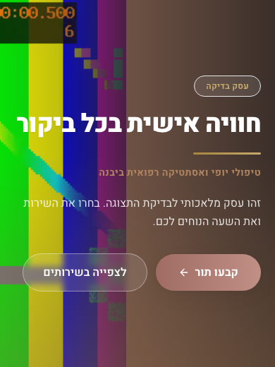
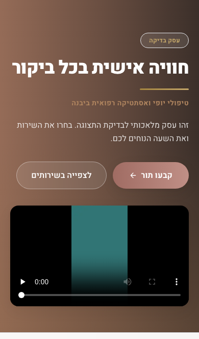

# תיקוני רגרסיה ובדיקת השוואה

## מצב הקבלה

שער השחרור המקומי המלא עבר: 855 בדיקות יחידה, 56 בדיקות מסד נתונים ונתיבים, 29 בדיקות דפדפן, בדיקת טיפוסים, בדיקה סטטית, בניית ייצור ו־38 הגירות, כולל מסלול שדרוג ושחזור. לא היו כישלונות או דילוגים בריצה המסכמת. הסקירות העצמאיות של המדיה ושל התצוגות המפורטות להלן הסתיימו ללא חסם חדש בתחום שנבדק.

השינוי מיועד לבקשת שינוי בטיוטה. קבלת האתר בייצור נשארת פתוחה עד לאישור ופריסה נפרדים. לא בוצעו פריסה, מיזוג או שינוי נתונים ונכסים בייצור.

מקור ההשוואה לפני הביקורת:

```text
0ea8d5d8240daa024e89f4b4df415499f32b7799
```

המקור שנפרס לאחר הביקורת:

```text
0db8ad6a73ef394381f49621e69570544a198e2c
```

## התקלות והשינויים

### סרטון הפתיחה

הביקורת העבירה את הסרטון מפס צדדי, בגובה אזור הפתיחה ובחיתוך ממלא, לנגן נפרד ביחס רוחב קבוע עם פקדי דפדפן. זהו שינוי התנהגות ועיצוב שגרם לרגרסיה המדווחת.

הוחזרו המיקום והמידות המקוריים: רוחב של 46 אחוז במסך צר ו־34 אחוז החל מנקודת המעבר הקיימת. הוחזרו הפעלה אוטומטית מושתקת, חזרה מחזורית וניגון בתוך העמוד. אותה התנהגות משותפת לעמוד העסק ולתצוגת העורך, תוך שמירת הגאומטריה הייחודית לכל אחד מהם. אין תנאי המבוסס על כתובת של עסק מסוים.

נוסף פקד נגיש לעצירה ולהמשך. עצירת קובץ וידאו שומרת את המקור, הפריים וזמן הניגון. יציאה מהמסך עוצרת את הניגון ושומרת את המקור שכבר נטען. בהעדפת תנועה מופחתת או חיסכון בנתונים, טעינת הסרטון הראשונית ממתינה לבחירה מפורשת. סירוב להפעלה אוטומטית וכשל טעינה משאירים תמונת רקע ופעולה ידנית.

בהטמעות חיצוניות נשמרים פרמטרי הניגון הדקורטיבי. עצירת הטמעה מסירה את המסגרת, והפעלה מחדש יוצרת אותה מחדש. רציפות זמן הניגון בהטמעה חיצונית אינה מובטחת. ספקי ההטמעה מוחלפים בבדיקות במסגרות מקומיות מבוקרות; הבדיקות מוכיחות כתובת, פרמטרים, מידות ודחיית טעינה, ואינן מוכיחות את נגן הספק האמיתי.

### תאימות לרינדור תמונות גדולות

תמונה בגודל 4284 על 5712, הכוללת 24,470,208 פיקסלים, נדחתה לאחר הוספת מגבלת 20 מיליון הפיקסלים. נוספה תאימות רינדור מוגבלת לפורמט הבא:

```text
JPEG
```

התאימות חלה על כל מקור מותר בפורמט זה. גיל הנכס ומקורו ההיסטורי אינם נאכפים כתנאי. העלאות חדשות ופורמטים אחרים נשארים במגבלה של 20 מיליון פיקסלים.

| גבול | מדיניות |
| --- | --- |
| קלט | עד 8 מביבייט ועד 32 מיליון פיקסלים במסלול התאימות |
| פלט לקלט מעל 20 מיליון פיקסלים | צלע מרבית 1280 פיקסלים ועד 250 קיביבייט |
| תור פענוח מורחב | עבודה פעילה אחת ועד שלוש ממתינות לכל מופע מודול |
| המתנה בתור | עד 12 שניות |
| קידוד | עד ארבעה ניסיונות, מגבלת חמש שניות לכל פעולה |
| מקורות | בדיקות המקור, הכתובות, ההפניות והחיבור המאובטח נשמרו |

שליפת הקלט וקריאת המטא־נתונים מתרחשות לפני הכניסה לתור המורחב. רינדור רגיל ורינדור תמונות שיתוף יכולים להתבצע במקביל. אין מגבלת זיכרון כוללת לתהליך, ואין תיאום תורים בין מודולים או העתקים.

מדידות של תהליך ניסויי מקומי היו בקירוב 109 ו־179 מביבייט עבור תמונות רגילה והדרגתית. אלו אינן מדידות העומס הכולל של שרת היישום ואינן הוכחה למרווח זיכרון תחת עומס מקביל. משאבי הייצור שנמסרו בסקירה הם חצי גיביבייט ורבע ליבת מעבד. יש להשאיר מגבלת תפעול זו מפורשת; לא בוצעו הגדלת משאבים או ניסוי עומס בייצור.

הבדיקה משתמשת בתמונה סינתטית באותן מידות, צורכת את גוף תשובת נתיב התמונה ומוודאת פלט מלא ושמירת שני אזורי הצבע. הקובץ המקורי ורשומות הייצור נשארו ללא שינוי.

### אייקונים ותמונות שיתוף

עזר טעינת התמונות החדש החזיר מקור מוטמע בפורמט שמפענח תמונות השיתוף אינו תומך בו. צריכת גוף התשובה גרמה לחריגת ההזרמה שנצפתה.

```text
data:image/webp
TypeError: u2 is not iterable
```

רק עזרי תמונות השיתוף והאייקונים ממירים את הפלט המסונן לפורמט נתמך:

```text
data:image/png
```

הפלט הסופי נבדק גם לאחר ההמרה, לרבות מגבלת 250 קיביבייט והקטנת המידות בעת הצורך. נשמרים תור הרינדור והמטמון המוגבלים. אופטימיזציית המקור קודמת לאיחוד בקשות המטמון. פורמט התמונות הרגילות באתר נשאר ללא שינוי.

בדיקות קבועות צורכות את גוף מחולל התמונה בפועל. בדיקות הדפדפן צורכות ומפענחות את אייקוני המניפסט ואת תמונת השיתוף של עסק סינתטי.

## שיטת ההשוואה

שלוש גרסאות המקור נבנות באותה סביבת הרצה, באותן תלויות נעולות ובאותו מסד נתונים סינתטי ומבודד. לכל מקור היסטורי נוצר לקוח נתונים פרטי מהסכמה שלו. ההשוואה מבודדת את השפעת קוד המקור על הממשק; היא אינה שחזור של תלויות ישנות ופגיעות.

רוחבי הבדיקה הם 360, 390, 768 ו־1366 פיקסלים. השפה, השעון, גובה חלון התצוגה והמדיה זהים. צילום הווידאו מוקפא באותה נקודת זמן לאחר מדידת ניגון ופענוח ממשיים. התעבורה החיצונית בדפדפן חסומה, והספקים החיצוניים מוחלפים באופן מפורש.

מדידת הביצועים כוללת שלוש הרצות קרות לכל מקור, ברוחב 390 ובגובה 844 פיקסלים, קצב העברה של 200,000 בתים בשנייה, השהיה של 150 אלפיות השנייה והאטת מעבד פי ארבעה. נשמרים זמן ציור התוכן הגדול, נפח תעבורה ומצב ניגון מפוענח. אי־ניגון בגרסה שנפרסה יוצג כחלק מהתוצאה ולא כשיפור ביצועים תקין.

### תוצאות ההשוואה

נלכדו 28 עמודים בכל גרסה. לא נמצא גלישה אופקית או שגיאת דף בצד הלקוח בצילומים אלה. שמונה השוואות של גאומטריית קובץ וידאו ושמונה של הטמעה התאימו למקור שלפני הביקורת. זהו כיסוי סופי ומוגדר של התצוגות שנמדדו.

| מקור | חציון ציור תוכן גדול, אלפיות השנייה | בתי משאבים | בתי סרטון | ניגון מפוענח |
| --- | --- | --- | --- | --- |
| לפני הביקורת | 812 | 371,279 | 63,659 | בשלוש ההרצות |
| הגרסה שנפרסה | 788 | 310,096 | 0 | חסר בשלוש ההרצות |
| התיקון | 828 | 389,061 | 63,659 | בשלוש ההרצות |

הספירה כוללת משאבי עמוד מתוך מדידות הדפדפן, ללא מסמך הניווט הראשי. התיקון מוסיף 78,965 בתי משאבים ביחס לגרסה שנפרסה, ומתוכם 63,659 הם תעבורת הסרטון שחזר להתנגן. לעומת המקור שלפני הביקורת, ההפרש הוא 17,782 בתים ו־16 אלפיות השנייה בחציון. המדידה מבוססת על מדיה סינתטית קטנה בשרת מקומי; גודל סרטון אמיתי, רשת אמיתית ועומס השרת יכולים לשנות את התוצאה.

הסקירה העצמאית בחנה את צילומי הקליניקה ברוחב 390, העסק החדש ברוחב 390, הקליניקה ברוחב 1366 והעסק הבסיסי ברוחב 390. היא אישרה שהרגרסיה משוחזרת ושהמיקום, החיתוך ומיקום הטקסט וכפתורי הפעולה חזרו למקור בתצוגות אלה. פקד העצירה הנגיש הוא הבדל מכוון.

מקור, גרסה שנפרסה ותיקון של אזור הפתיחה:






נבדקו גם הטקסט הארוך, תמונת הרקע וסרטון הקליניקה הקיימים במאגר, באכלוס המקומי הרגיל. ניגון ופענוח אומתו בכל ארבעת הרוחבים לפני הקפאת הצילום בחצי שנייה. הסקירה העצמאית בחנה את הצילומים ברוחב 390 ו־1366. הסמל בצילום המוקפא מציג את פעולת ההמשך; הוכחת הניגון נרשמת לפני ההקפאה.


תת־קבוצה של צילומים וקובצי המדידה נשמרו במאגר. כל סט הצילומים נשמר גם כתוצר פרטי של המשימה. חתימות קובצי המקור של התיקון מצורפות כדי לקשור את התמונות למימוש שנמדד.

```text
docs/regression-evidence-2026-09-07/
  result.json
  full-gate.json
  flows/
  pre-audit/geometry.json
  pre-audit/performance.json
  deployed/geometry.json
  deployed/performance.json
  candidate/geometry.json
  candidate/performance.json
```

## מטריצת קבלה סופית

המטריצה מבוססת על הריצה המסכמת. מסלולי הכניסה, ההקמה, ההזמנה ורשימת ההמתנה נבדקו גם ברוחב 390. ארבעת הרוחבים חלים על מטריצת העמודים וסרטוני הפתיחה. תוצאת הריצה המלאה נשמרה עם חתימות קובצי המקור והבדיקות.

| מסלול | פעולות מכוסות | מצב מסכם |
| --- | --- | --- |
| בית, הדגמה, עסק בסיסי, קליניקה ועסק שפורסם | ארבעה רוחבים, כיווניות, גלילה, תמונות וניווט | עבר |
| סרטון עסק | מידות, חיתוך, פריימים, זמן ניגון, עצירה והמשך, גלילה וכפתור הזמנה | עבר |
| חלופות מדיה | תנועה מופחתת, חיסכון בנתונים, סירוב הפעלה וכשל קובץ | עבר |
| הטמעות | שתי מסגרות ספק מבוקרות, כתובות ומידות | עבר בגבולות התחליף |
| בעל עסק | כניסה, שירותים, שעות, מיתוג, חיתוך, ניסיון העלאה חוזר, עורך ופרסום | עבר |
| כניסת לקוח | דואר וטלפון, קוד שגוי, ניסיון חוזר וחשבון אמיתי במסד המבודד | עבר |
| הזמנה | שירות, איש צוות, תאריך, שעות, סיכום ואישור | עבר |
| חשבון וביטול | לקוח עם מושב חתום מקומי, ביטול דרך הממשק ושמירה אטומית במסד | עבר |
| ניסיונות חוזרים | תשובה שאבדה ושחזור הזמנה שבוטלה | עבר |
| רשימת המתנה | ולידציה, כשל רשת, ניסיון חוזר ורשומה יחידה | עבר |
| ניהול והרשאות | תפריט בעל עסק והגדרות, הפניית אורח, מסך מנהל־על מוגן ופעולות ללא הרשאה | עבר |
| התקנה ותמונות שיתוף | פתיחת חלונית וסגירתה, מניפסט, פענוח אייקונים ותמונת שיתוף | עבר |
| מסירת דואר ומסרון אמיתיים | ספקי מסירה מוחלפים; האימות וההתחברות אמיתיים במסד המבודד | לא הורץ |
| התקנה במערכת הפעלה פיזית | חלונית הדפדפן בלבד נבדקת | לא הורץ |
| דפדפני טלפון פיזיים ונגני ספק אמיתיים | אין מכשיר פיזי או בדיקת ספק מקצה לקצה | לא הורץ |
| יתר פעולות הניהול ומעבר בין בעלי עסקים בדפדפן | הכיסוי מוגבל לפעולות המפורטות; בידוד והרשאות נבדקים גם בנתיבים ובמסד | לא הורץ במלואו |
| נתוני ייצור ועומס ייצור | אין הרשאה לשינוי נתונים או לניסוי עומס | לא הורץ |

מסירת קוד, אחסון העלאות ונגני ספק חיצוני מוחלפים במפורש. זרימת הקוד השגוי והקוד הנכון, יצירת המושב, יצירת העסק, הפרסום, ההזמנה והביטול מתבצעים מול היישום ומסד הנתונים המקומיים. בדיקות המדיה הנפרדות מפעילות את עזרי הפענוח ונתיבי התמונה האמיתיים.

### כישלונות ביניים ותיקונם

ריצות הביניים נשמרו כתיעוד של הבדיקה. כלי ההשוואה נדרש לתיקוני הפרדת טיפוסים של הסכמה ההיסטורית וסריאליזציה של קוד הדפדפן. בדיקות הממשק תוקנו בהתאם למסכים שנצפו בפועל: קישור ההגדרות נמצא בתוך תפריט במסך צר, בחירת איש צוות יחיד אוטומטית, ברכה אישית בחשבון במקום כותרת מטא־נתונים, ומסך אי־מציאה שיכול להגיע אחרי תחילת תשובת הזרמה מוצלחת. לא שונו חוזי היישום כדי להתאים לציפיות השגויות.

הסקירה העצמאית גילתה גם פגם בתיקון הראשוני: עצירה הסירה את מקור הסרטון ואיפסה את הזמן. המימוש תוקן לשמירת המקור, ונוספה בדיקה המשווה זמן ופריים קבועים במהלך העצירה והתקדמות מאותה נקודה לאחר המשך.

## אחריות ופערי הבדיקה הקודמת

שינויי הביצועים בביקורת עיצבו מחדש את סרטון הפתיחה בלי קבלה חזותית מספקת. מגבלת הפיקסלים חסמה תמונה קיימת ולגיטימית. המרת פורמט התמונה שברה את מפענח האייקונים ותמונות השיתוף. שלוש הרגרסיות נוצרו במסגרת ההקשחה הקודמת, גם כאשר 838 בדיקות יחידה, 56 בדיקות מסד ו־10 בדיקות דפדפן עברו.

הבדיקות הקודמות כיסו חוזים וזרימות מצומצמות. הן לא הוכיחו התאמה חזותית למקור, ניגון ופענוח ממשיים, התאמה למידות נכסים קיימים או צריכת גוף מלאה של מחולל התמונה. שיפור במדדי טעינה היה בחלקו תוצאה של ביטול ניגון שהיה חלק מהמוצר.

המניעה הקבועה כוללת השוואת מקור לפני ואחרי, ראיות ניגון ופריים, בדיקות חלופות והעדפות משתמש, נכס סינתטי במידות התמונה שנחסמה, פענוח גוף האייקון ותמונת השיתוף, מסלולי העלאה ופרסום בדפדפן, ומינימום של 29 בדיקות דפדפן ללא דילוגים בשער המלא. סקירה חזותית עצמאית ומטריצה מפורשת של מה שלא הורץ נשארות חלק מתהליך הקבלה. שינויי אבטחה והרשאות מאושרים נשמרו.

## שחזור מקומי

נדרשות גרסאות סביבת הרצה התואמות לשער הקיים:

```text
Node 22.23.2
npm 10.9.8
```

השוואת המקורות:

```bash
TEST_APP_PORT=3157 TEST_DB_PORT=55457 npm run test:release -- --skip-static --compare-public
```

שער השחרור המלא:

```bash
TEST_APP_PORT=3157 TEST_DB_PORT=55457 npm run test:release
```

הפקודות מקימות מסד נתונים ושרת מקומיים מבודדים, בודקות שהיציאות פנויות ומנקות את המשאבים שבבעלותן. הרצה ממוקדת או הרצת השוואה מסומנות כשער חלקי.
